# CH32V_EVB开发套件TencentOS Tiny 入门指南

| Revision | Date      | Description |
| -------- | --------- | ----------- |
| 1.0     | 2022-05-15 | CH32V_EVB开发套件TencentOS Tiny 入门指南    |

## 一、定制开发板CH32V_EVB硬件简介

### 1.1 开发板简介

CH32V_EVB是腾讯物联网操作系统TencentOS tiny 团队联合沁恒微电子设计的一款物联网评估板，用于TencentOS tiny 基础内核、RISC-V IP核架构和IoT组件功能体验和评估。
开发板实物如下图：

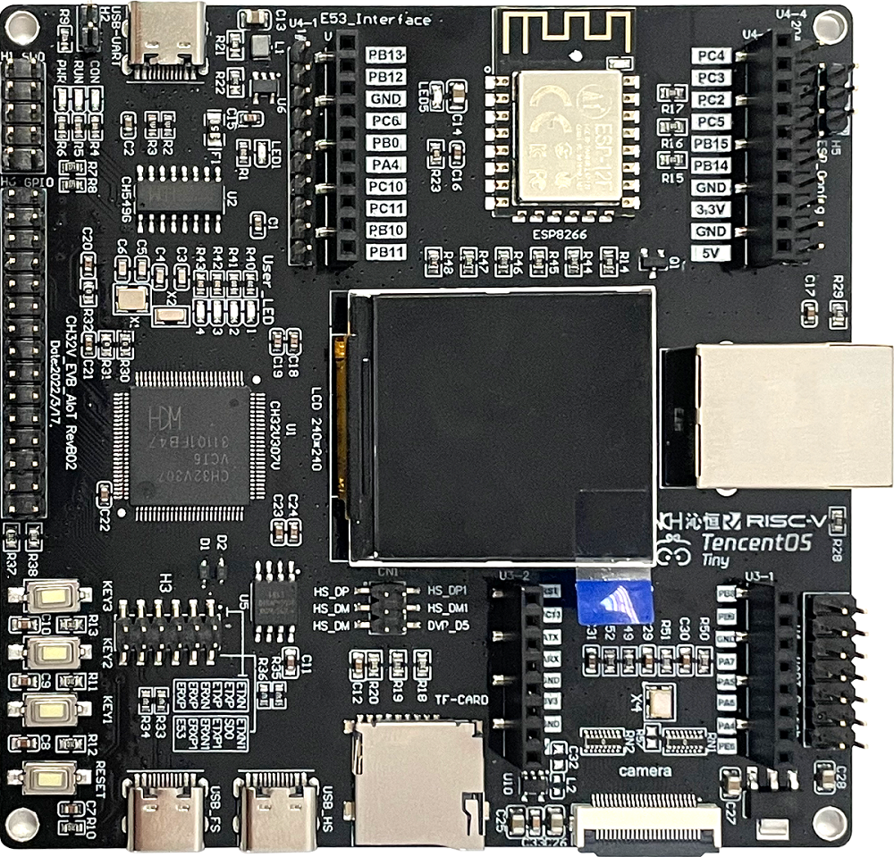

### 1.2 开发板特性
- 内置TencentOS Tiny开源物联网操作系统
- 开发板采用沁恒RISC-V MCU CH32V307VCT6芯片，CH32V305/7系列是基于沁恒自研RISC-V架构微处理器青稞V4系列设计的32位工业级互联型微控制器，配备了硬件堆栈区、快速中断入口，在标准RISC-V基础上大大提高了中断响应速度。加入单精度浮点指令集，扩充堆栈区，具有更高的运算性能。扩展串口UART数量到8组，定时器到10组，其中4组高级定时器。提供USB2.0高速接口（480Mbps）并内置了PHY收发器，以太网MAC升级到千兆并集成了10M-PHY模块。
- 64KB SRAM，256KB Flash
- 板载Type-C接口WCH-LINK仿真器
- 板载esp8266 WiFi模组，支持腾讯云固件
- 板载以太网接口
- 板载物联网俱乐部WAN Interface接口，可支持NB-IoT、WiFi、4G cat1、LoRa等模组
- 板载物联网俱乐部E53 Interface接口，可扩展全系E53传感器以及音频模块；
- 板载标准24P DVP摄像头接口，可支持最高500万像素摄像头；
- 板载1.54寸 IPS高清显示屏，支持240*240分辨率；
- 预留SD卡、用户按键、SPI Flash，
- 扩展IO口，方便开发者扩展硬件模块 

### 1.3 开发板硬件详解

#### 1.3.1 电源电路
* 电源稳压电路
外部USB输入电压一般为5V，但这并不能直接作为电源给开发板供电，CH32V_EVB上的元器件供电电压范围普遍在1.8V-3.6V，推荐电压均为3.3V，因此需要将5V的电平转换成3.3V供给开发板上数字IC使用，这里使用TLV62569DBVR作为3.3V稳压器芯片。
TLV62569DBVR是TI出品的一款高效率脉冲宽度降压型DC/DC转换器。输入电压2.5V-5.5V，输出电压可调范围为：0.6V-5.5V，输出电流可以达到2A。在我们提供的电路中将输出调节至3.3V，让开发板正常工作。
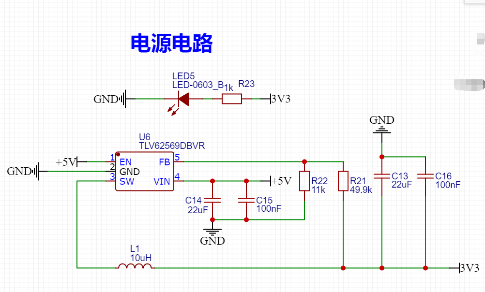

#### 1.3.2  CH32V最小系统电路
单片机最小系统或者叫最小硬件单元电路，指用最少元器件组成的单片机可以正常工作的系统。最小系统基本由电源、单片机、晶振、按键复位电路、用户LED等接口组成，电源使用3.3V直接供电，其他部分原理图如下：
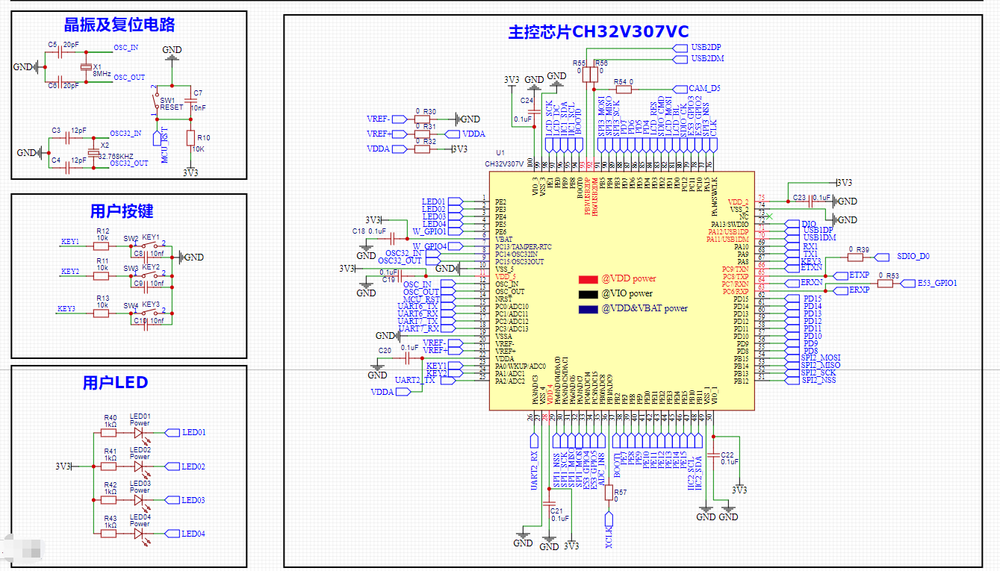

#### 1.3.3  WCH-Link仿真器下载器电路
板载仿真器可以让开发调试更方便。WCH-Link是沁恒微电子官方提供的MCU仿真器方案，可以支持CH32V系列risc-v MCU下载调试，也可以支持ARM Cortex M核下载调试，同时支持虚拟串口功能，电路如下：

#### 1.3.4  LCD显示电路
TFT LCD液晶显示模块用来向用户显示系统状态、参数或者要输入系统的功能。为了展示良好的视觉效果，开发板使用ST7789V 控制器驱动的TFT LCD显示屏，分辨率为240*240。该款LCD使用SPI接口，由于SPI接口空闲时引脚要上拉，因此下面的原理图中接了10k电阻上拉，然后才接入MCU引脚。
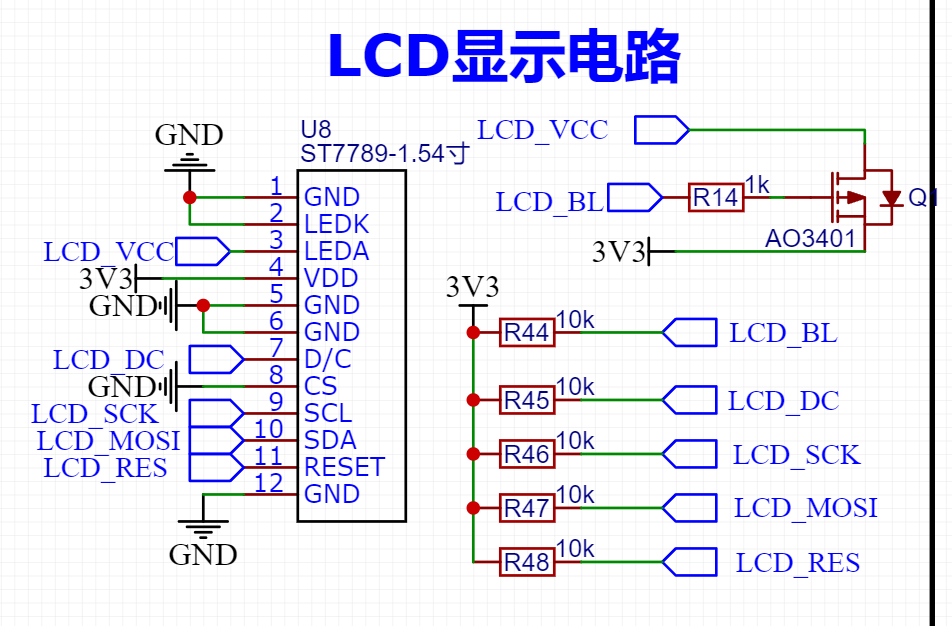

#### 1.3.5 以太网电路
开发板主控CH32V307芯片内置了以太网控制器，这里外围电路只需要使用一个RJ45以太网变压器 HY911105AE即可，HY911105AE带变压器和LED灯，电路如下图所示：

#### 1.3.6 USB HOST/Device电路
开发板主控CH32V307芯片内置了一个高速和低速USB控制器，这里开发板将两个UCB都通过TYPE-C口引出了，电路如下：

#### 1.3.7  存储电路扩展
开发板带有一个SPI Nor Flash芯片扩展和单bit SD卡扩展，可用于用户存储一部分数据和存储空间扩展，电路图如下：
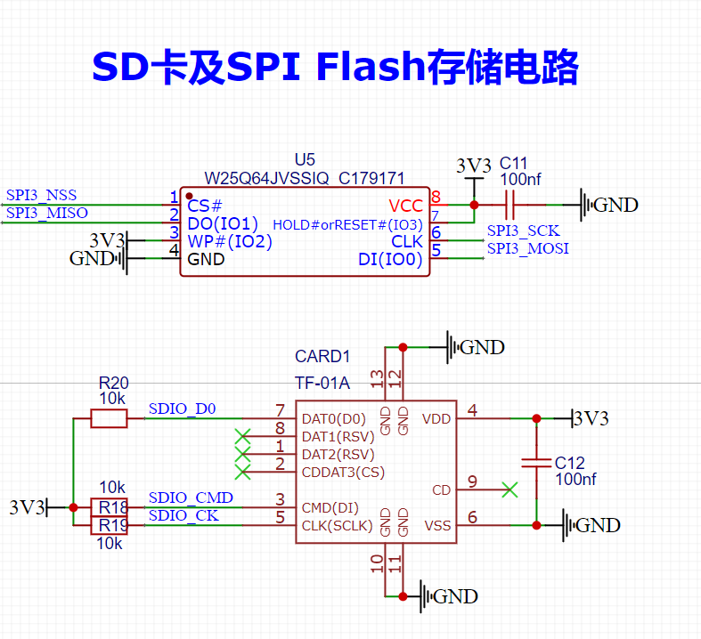

#### 1.3.8  多串口切换电路
开发板带有多串口切换功能，通过跳线帽可以切换串口映射关系，通过组合，可以使用PC机上的串口助手发送AT命令来调试WAN口的通信模组或者板载WiFi；也可以使用正常模式通过MCU串口来控制WiFi和WAN口模组，同时wch-link虚拟串口连接PC可以做日志输出。串口切换电路图如下：

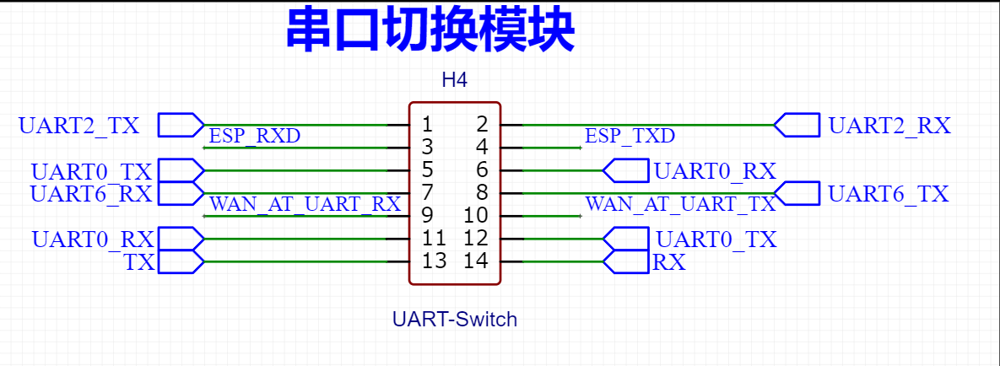

#### 1.3.9 E53 传感器扩展接口
开发板设计有E53接口的传感器扩展板接口，该接口可兼容所有E53接口的传感器扩展板，实现不同物联网案例场景的快速搭建。该接口可接入UART、SPI、I2C、ADC等通信协议的传感器，也可以扩展音频模块，其原理图如下图所示。
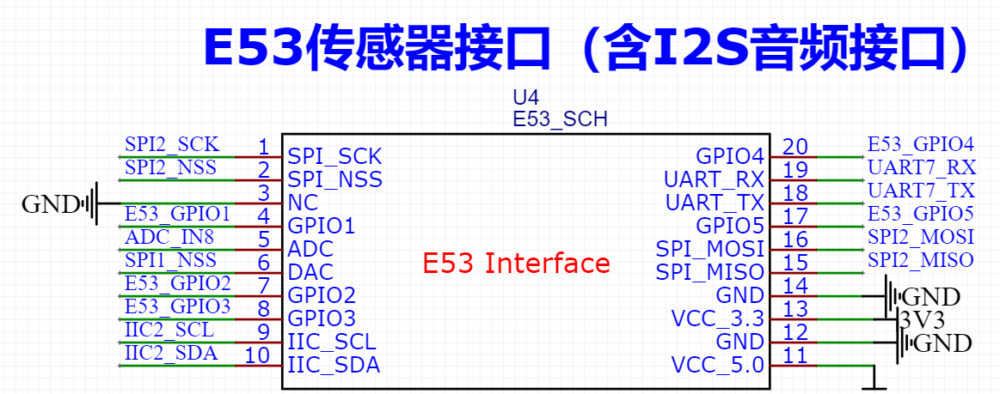

#### 1.3.10 WAN通信模块扩展接口
开发板设计有通信扩展板的扩展接口，该接口可接入WIFI、NB-IoT、2G、腾讯定制IoT模组、LoRaWAN等不同通信方式的通信扩展板，以满足不同场景上云的需求，其原理图如下图所示。

#### 1.3.11 ESP8266 WIFI电路

开发板板载了一个esp8266 WiFi模块，通过串口AT命令进行控制，电路如下图所示：

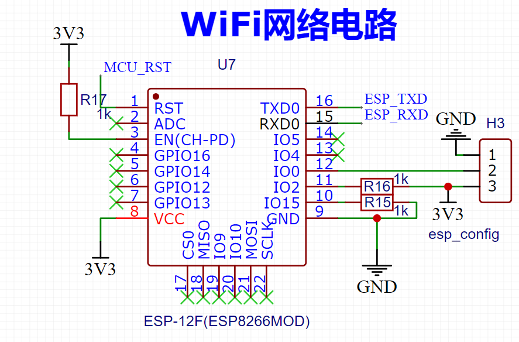

#### 1.3.13 摄像头电路

开发板板载了标准的DVP 24P摄像头接口，可以接OV2640 OV5640等摄像头模组，MCU芯片内置DVP摄像头控制器，电路图和控制引脚参考如下：

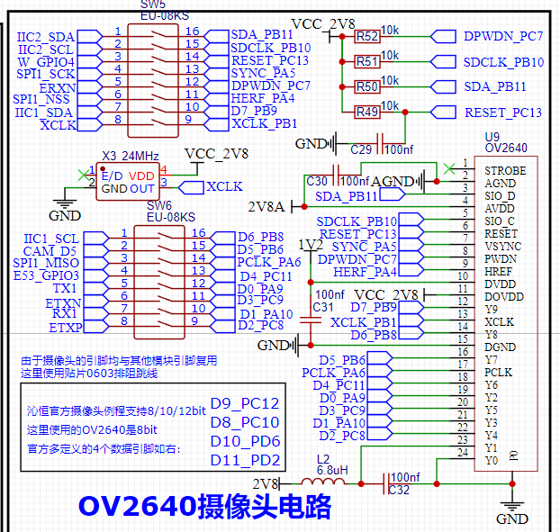

#### 1.3.12  扩展IO

开发板多余的IO引脚全部引出，如下图所示：

## 二、 定制开发板CH32V_EVB软件开发环境准备

### 2.1 MounRiver Studio IDE下载与安装

MounRiver Studio（MRS）是一款面向RISC-V、ARM等内核MCU的集成开发环境，提供专业嵌入式项目所需的开发、调试环境、烧录工具已经完善的项目管理能力，是目前使用相对方便的国产自研RISC-V开发环境。这里我们使用该IDE来进行risc-v相关应用开发。首先，我们到MounRiver Studio官网下载软件安装包，下载地址：http://www.mounriver.com/download

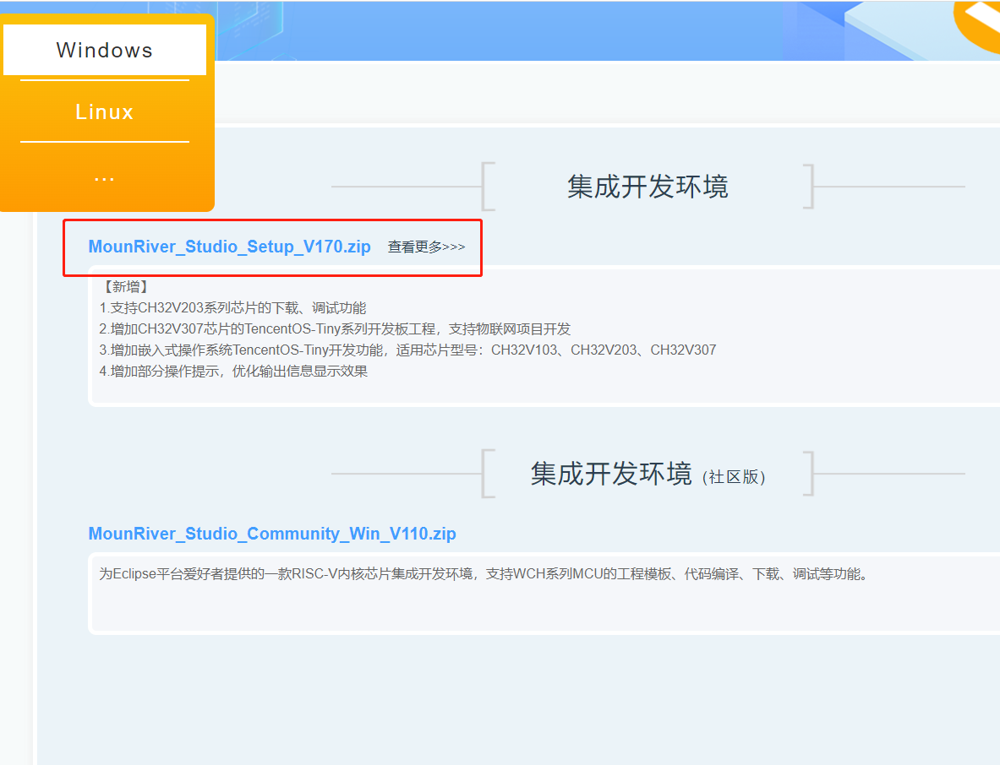

安装完成后打开软件可以进入到欢迎界面

### 2.2 新建CH32V工程

菜单栏点击File->New->MounRiver project 开始创建工程

进入工程向导后，按照如下图所示选择芯片，填写工程信息。

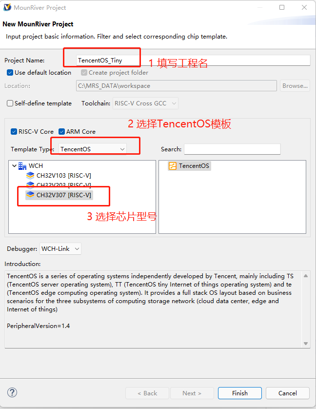

完成后会生成工程，如图所示：

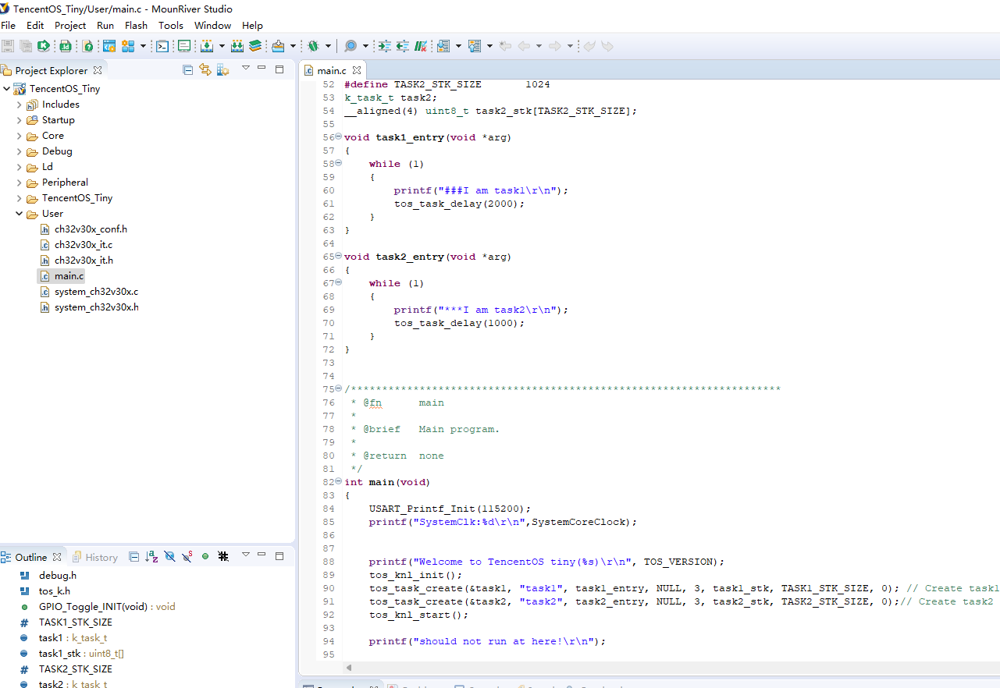

### 2.3 编译下载调试CH32V工程

MRS IDE默认集成了TencentOS Tiny工程模板，一键即可生成TencentOS TIny 内核基础工程，点击如下图所示图标编译工程，编译完成后可以在控制台输出看到编译结果。

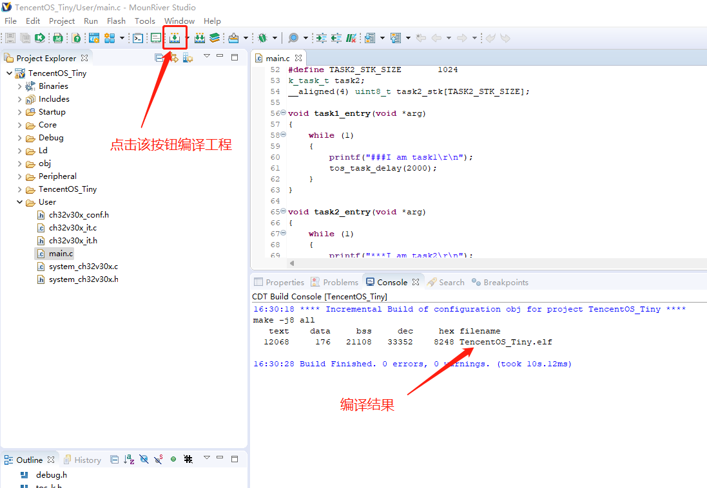

如下图所示，使用USB线连接和PC机和开发板，点击debug按钮，就可以进入调试模式，程序下载到开发板上，可以打断点、单步、跳步执行，全速执行，查看寄存器，反汇编、内存等

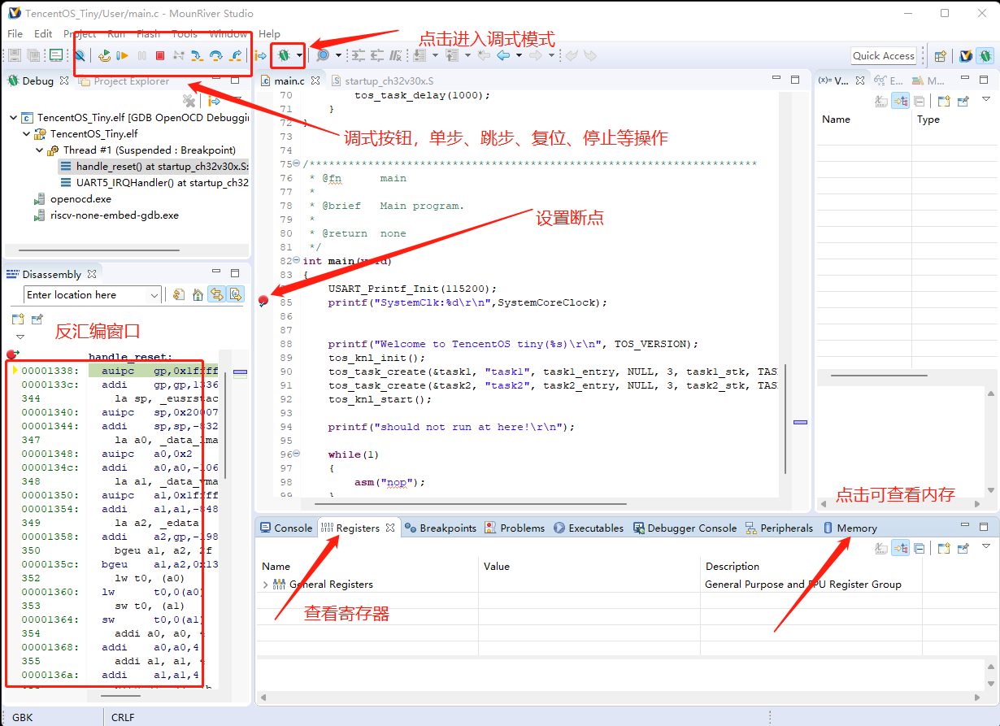

全速运行后，可以看到串口助手打印TencentOS Tiny的日志信息，可以看到两个任务交替运行。

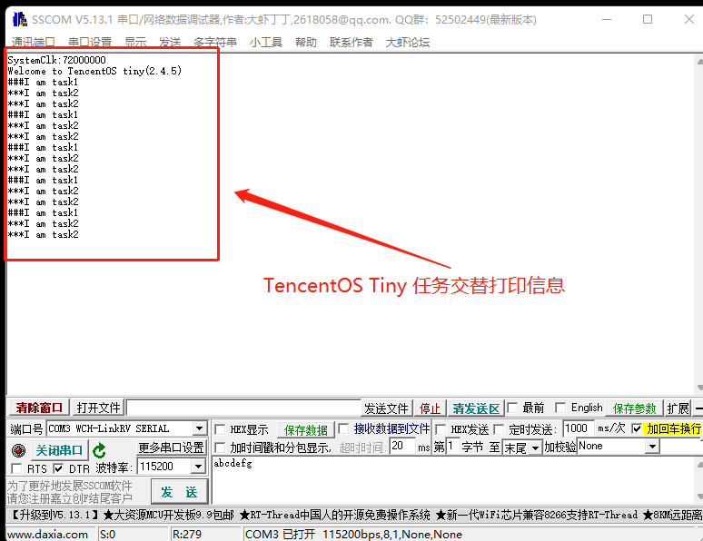

除了调试按钮外，我们也可以点击下载按钮直接将程序烧写到开发板上，如下图所示：

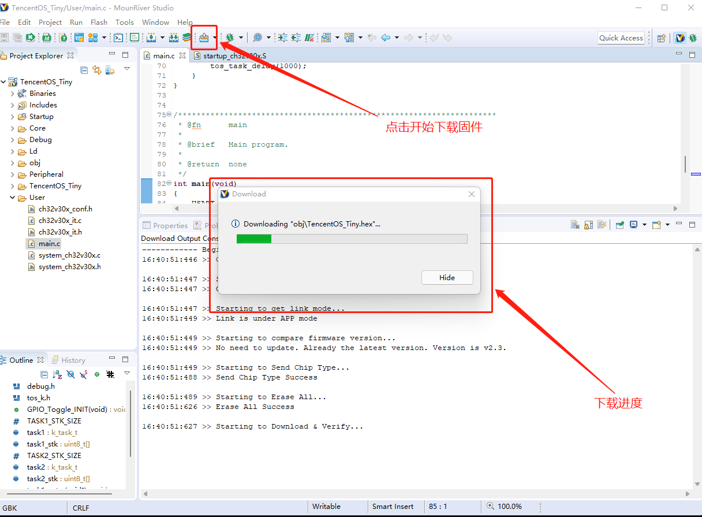

##  三、基于TencentOS Tiny 和CH32V_EVB开发板对接腾讯云物联网平台和腾讯连连小程序

基于TencentOS Tiny CH32V_EVB RISC-V 开发板要完成腾讯云IoT Explorer对接，需要完成两个部分的工作。 
一是：腾讯云IoT explorer 上完成项目、产品、设备创建、参数配置 
二是：基于TencentOS Tiny完成应用开发，向腾讯云上报业务数据。

### 1. 云端操作步骤
1.1. 新建项目
登录[腾讯云物联网开发平台](https://cloud.tencent.com/product/iotexplorer)，点击新建项目，填写项目名称和简介：

1.2. 新建产品
点击项目名称进入到该项目中，点击新建产品：

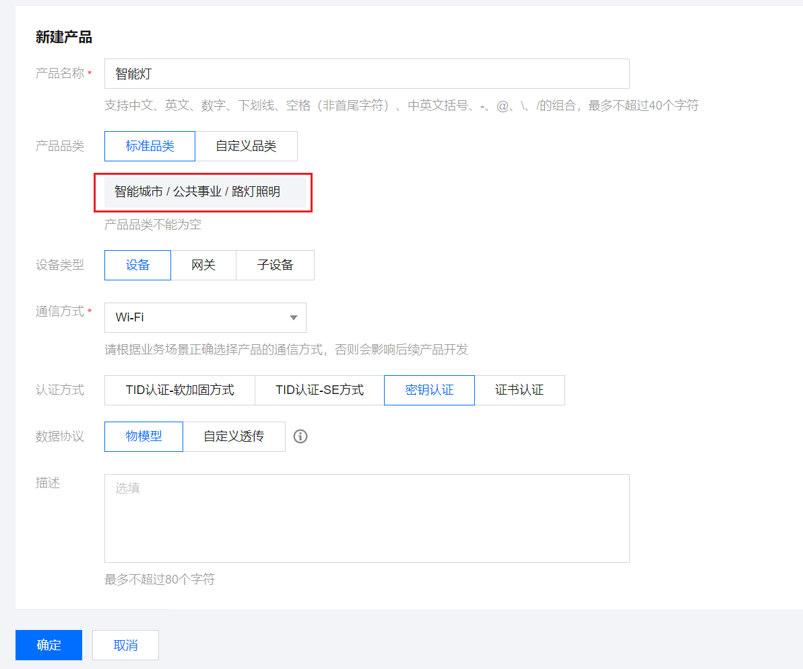

产品新建成功后，可在产品列表页查看到：

1.3. 数据模板

平台自动创建的物模型（数据模板）如下：

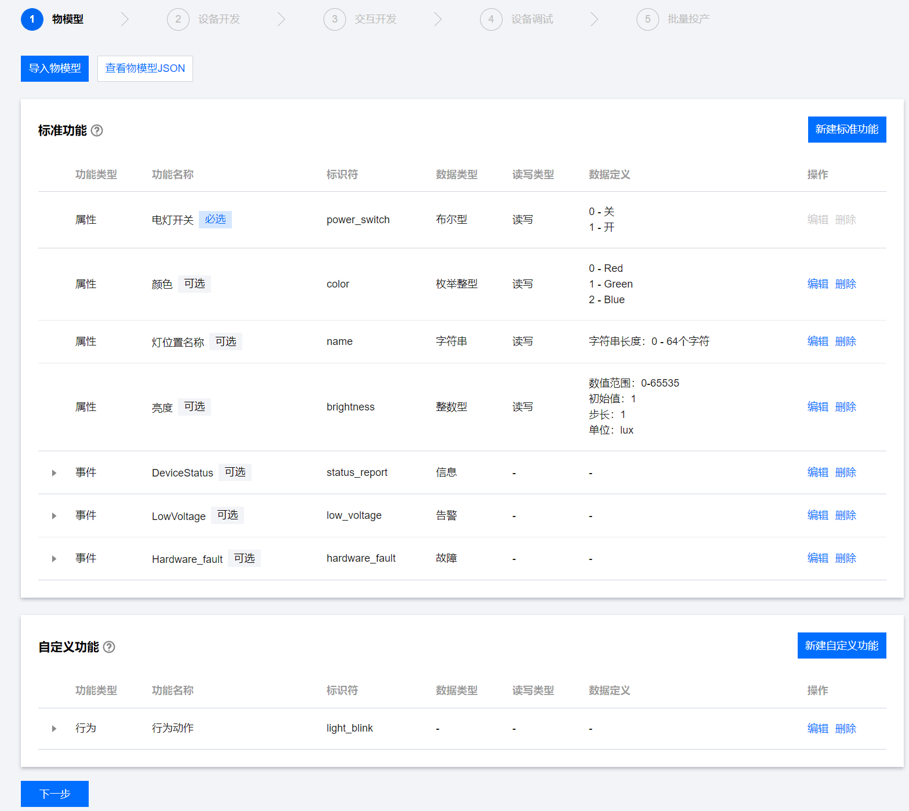

1.4. 创建设备
点击【设备调试】，进入后点击【新建设备】，创建真实设备：

创建成功之后进入设备，查看到产品ID、设备名称、设备秘钥,记录下来，一会终端程序会使用到。

### 2. 基于TencentOS Tiny 完成设备侧应用开发

CH32V-RISC-V物联网操作系统TencentOS-Tiny案例实践指南

https://github.com/OpenAtomFoundation/TencentOS-tiny 上clone整个代码仓源码，进入 < TencentOS-tiny\board\TencentOS_Tiny_CH32V307_EVB> 目录，打开 CH32V_EVB_TencentOS_Tiny_IoT_Explorer工程。

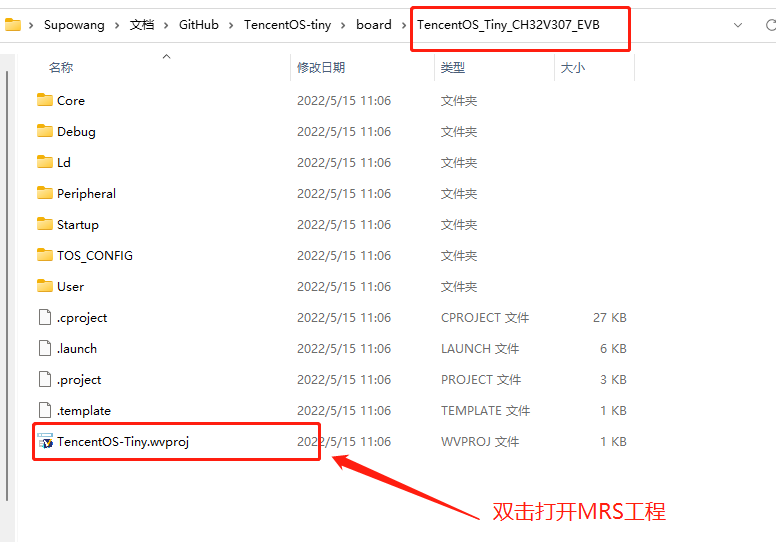

2.1. 修改WIFI接入信息
打开`mqtt_iot_explorer.c`文件编辑，在mqtt_demo_task函数中修改要接入WIFI的名称和密码（建议使用手机热点，不要有特殊字符）：

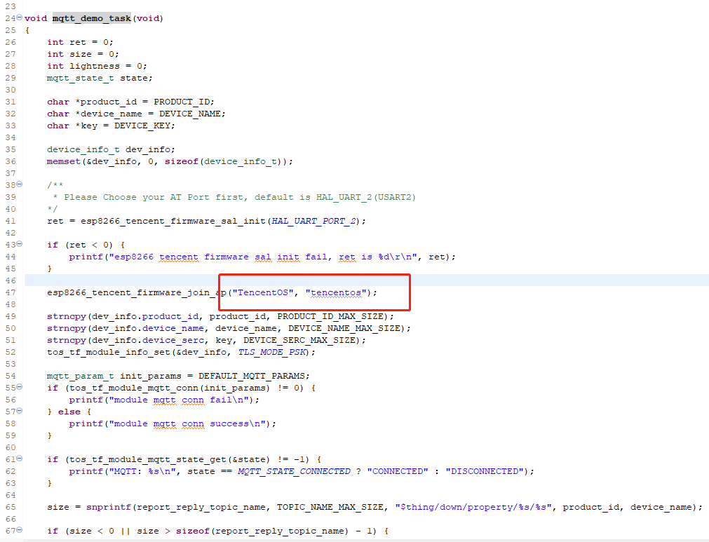

2.2. 修改云端对接信息
终端的MQTT客户端需要对应的产品ID、设备ID，密码，我们使用前面从云端获取到的产品ID、设备名称、设备密钥，

2.3. 编译工程
点击编译按钮，编译整个工程并将程序下载到开发板。下载完成，打开热点，复位开发板，我们可以看到终端输出相关log，如下图：

### 3. 云端平台查看设备数据
回到腾讯云物联网开发平台，可以看到设备状态变为【在线】：

点击【设备日志】一栏，可以看到设备上报的光照强度：

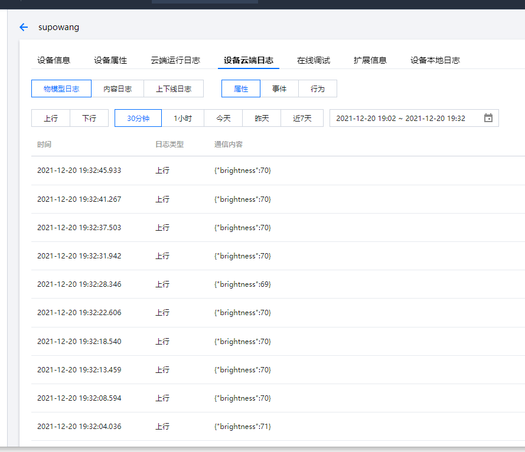

点击【在线调试】一栏，修改属性【期望值】后点击【发送】，可以对灯泡进行远程控制。

### 4、腾讯连连小程序操作步骤
1. 添加家庭
手机端在【微信】搜索【腾讯连连】小程序，首次使用需要进入后点击【我的】->【家庭管理】，添加一个你喜欢的名称即可。

2. 添加调试设备
返回【首页】，点击右上角“加号”图标：

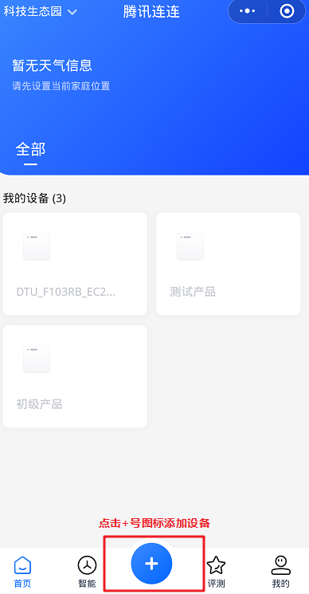

进入后点击右上角扫码图标：

在腾讯云物联网开发平台进入【设备调试】，点击对应设备后的【二维码】：

腾讯连连扫描此二维码即可成功添加设备，添加成功之后如图：

点击此设备即可实时查看数据，并下发控制指令：

3. 修改腾讯连连显示面板
进入【交互开发】，点击【面板配置】一栏：

在此页面中可以自己根据喜好配置小程序显示面板,保存之后，在腾讯连连小程序删除设备，重新扫描绑定设备即可生效。

